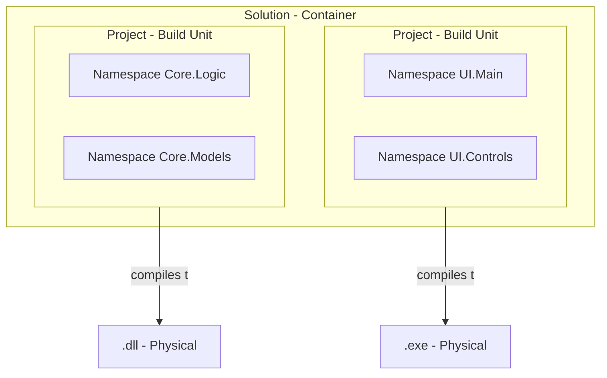

# 🧠 Namespaces vs. Projects vs. Assemblies — COMPLETE MASTER NOTE

---

## 📌 1. The Big Picture

In the world of C#, there are **three layers** of organization you MUST understand. If you confuse them, your project will become a mess!

1.  **Namespace**: Logical organization (The label on the folder).
2.  **Project**: The compilation unit (The box of tools for the garage).
3.  **Assembly**: The physical output (The machine part).

---

## 📂 2. Level 1: Namespaces (Logical Organization)

**Namespace** is used to group related classes together.

### ✅ What it looks like:
```csharp
namespace MyApp.Core.Models {
    public class User { ... }
}
```

### ✅ Why we use it:
*   **Prevent naming conflicts**: You can have two different `User` classes if they are in different namespaces.
*   **Organization**: Easily find code related to "Models", "Services", etc.

> [!TIP]
> A single namespace can span across multiple files and even multiple projects (though common practice is to keep it within one project).

---

## 📄 3. Level 2: Projects (Build/Management Unit)

A **Project** is a group of files that are compiled together to produce a single output. It is defined by a `.csproj` file.

### ✅ What it looks like:
*   A folder containing `Program.cs`, `Helper.cs`, and `Something.csproj`.

### ✅ Why we use it:
*   It is the **unit of versioning** and **management**.
*   It defines dependencies (NuGet packages, other projects).

---

## ⚙️ 4. Level 3: Assemblies (Physical Unit)

An **Assembly** is the result of compiling a project. It is a physical file on your hard drive.

### ✅ Common formats:
*   `.dll` (Dynamic Link Library) – Reusable code (not runnable).
*   `.exe` (Executable) – A program you can run (has a `Main()` method).

### ✅ Why we use it:
*   It's what the **CLR (Common Language Runtime)** actually executes.
*   It's what you share or deploy.

---

## 🔄 5. Comparison Table

| Attribute | **Namespace** | **Project** | **Assembly** |
| :--- | :--- | :--- | :--- |
| **Layer** | Code / Logical | File / Build | Hard Drive / Physical |
| **Definition** | `namespace` keyword | `.csproj` file | `.dll` or `.exe` file |
| **Goal** | Organize Code | Manage Compilation | Execute Code |
| **Output** | None (logical) | The Assembly | Binary data |

---

## 🔗 6. How They Relate (The Breakdown)

1.  **One Project → One Assembly**: In 99% of cases, building one `.csproj` file creates exactly one `.dll` or `.exe` file.
2.  **One Assembly → Many Namespaces**: A single `.dll` can contain hundreds of namespaces (e.g., `MyApp.Models`, `MyApp.Data`, etc.).
3.  **One Project → Many Files**: A project is usually made of many `.cs` files.

---

## 🧪 7. Visualized Diagram



---

## 🚀 FINAL TAKEAWAYS

*   **Namespaces** = Logical grouping (labels).
*   **Projects** = The unit of compilation (`.csproj`).
*   **Assemblies** = The final output file (`.dll` / `.exe`).
*   **Namespace names** should usually match your **Project name** + **Folder structure**.
    *   *Example*: `MyApp.Services` namespace should be in `MyApp/Services/` folder.
