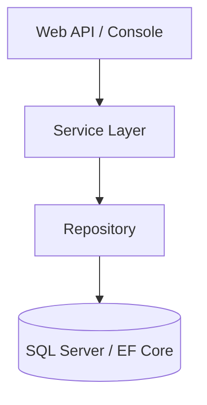

# 🏁 Master Notion Documentation: Backend Mastery Hub

This is your single, definitive guide for building and maintaining your learning hub in Notion. It combines setup instructions, database data, curriculum projects, and advanced polishing tips.

---

## 📅 Phase 1: The Workspace Structure (Hub & Spoke)

To stay organized in a shared environment:
1.  **Create your Personal Page**: In the Teamspace, create a page named **"Haile's Workspace"**.
2.  **Nest your Hub**: Inside your personal page, create the main hub page: **🚀 Backend Engineering Mastery**.

---

## 🛠️ Phase 2: Building the "Engine" (Databases)

Create these two master databases as sub-pages inside **"Haile's Workspace"**.

### 1. Master Knowledge Base (The Storage Room)
**Description:** Central repository for theory and architectural notes.

| Property Name | Type | Options / Values |
| :--- | :--- | :--- |
| **Topic** | **Title** (`Aa`) | The name of the specific lesson. |
| **Module** | **Select** | `1. C# Essentials` to `9. Advanced Consistency`. |
| **Status** | **Status** | `Not Started`, `In Progress`, `Done`. |
| **Note Type** | **Multi-select** | `Theory`, `Code Snippet`, `Architecture`. |
| **Projects** | **Relation** | Link to "Console App Log" (see below). |

### 2. Console App Log (The Portfolio)
**Description:** Every project you build gets logged here and linked to the theory.

| Property Name | Type | Options / Values |
| :--- | :--- | :--- |
| **App Name** | **Title** (`Aa`) | Name of your project. |
| **GitHub URL** | **URL** | Link to your repository. |
| **Module** | **Select** | (Same 9 modules). |
| **Difficulty** | **Select** | `🟢 Easy`, `🟡 Medium`, `🔴 Hard`. |
| **Related Topic** | **Relation** | Link to "Master Knowledge Base". |

---

## 📚 Phase 3: The Curriculum (Data to Populate)

### 🧩 Master Knowledge Topics
*Copy these into your Master Knowledge Base:*

1.  **C# Essentials**: OOP Principles, Interfaces, Generics, Async/Await, Task, Delegates, DI Concept.
2.  **ASP.NET Core**: DB Configuration, Service Layer, Middleware, DI Lifetime.
3.  **Persistence**: Separation of Concerns, Infrastructure vs Application Layer, Controller vs DbContext.
4.  **EF Core**: DbContext Tracking, POCOs, Migrations, Relationships, Fluent API Mapping.
5.  **Design Patterns**: Generic Repository, Unit of Work, Coordination.
6.  **LINQ**: IEnumerable vs IQueryable, Deferred Execution, Performance.
7.  **DB Strategy**: Code First vs Database First.
8.  **Advanced Persistence**: Fluent API Configurations, Transactions, Consistency.

### 🚀 Practice Projects (Console Apps)
*Build these small apps to master each module:*

- **Module 1**: `Simple-Bank-System`, `Hello-Interfaces`, `Generic-List-Storage`.
- **Module 2**: `DI-Console-Logger`, `Config-Reader-App`.
- **Module 3**: `Layered-Product-Catalog`, `Persistence-Mock-Models`.
- **Module 4**: `EF-Core-Blogging-App`, `Migration-Practice-App`.
- **Module 5**: `Generic-Repository-Lab`, `UnitOfWork-Simple`.
- **Module 6**: `LINQ-Performance-Tester`, `IEnumerable-vs-Query`.
- **Module 9**: `Order-Consistency-Sys`, `Basic-Transaction`.

---

## 💎 Phase 4: Premium Polishing (The Dashboard)

### 1. The Main Hub Dashboard
Type `/linked` on your main page to create a **Linked View** of the Master Database.
- **Filter**: `Status` is `In Progress`.
- **Group by**: **Module** (Click three dots `...` > Group > Module).

### 2. The Manager's View
Create a second view on your dashboard named **"Mastery Overview"**.
- **Layout**: **Board View**.
- **Filter**: `Status` is `Done`.
- **Benefit**: Show this view to your manager to demonstrate completion of modules.

---

## 📝 Phase 5: The Daily Workflow Cheat Sheet

1.  **💻 CODE**: Build a small project in Visual Studio.
2.  **🚀 PUSH**: Push your code to GitHub.
3.  **📓 NOTE**: Write your theoretical notes in the **Master Knowledge Base**.
4.  **🛠️ LOG**: Add the project to the **Console App Log**.
5.  **🔗 LINK**: Use the **Relation** property to connect the Topic to the Project.
6.  **✅ STATUS**: Update progress to `Done`.

**Project Architecture Bookmark:**

